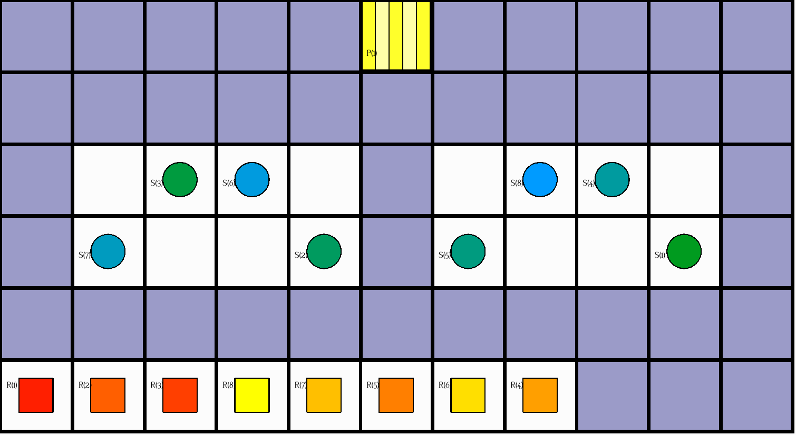
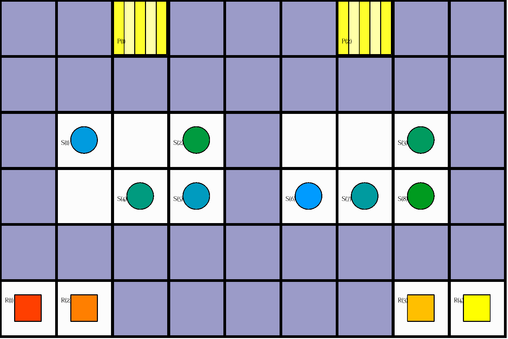
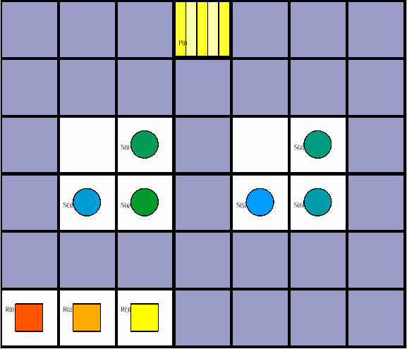

# *asprilo* Seminar Exercises

## About

This is a collection of seminar exercises for  [**asprilo**](<https://potassco.org/asprilo>).

## Preliminaries

 Before addressing the exercises, we strongly recommend you to study

- the asprilo [paper](https://arxiv.org/abs/1804.10247)
- the asprilo [website](<https://potassco.org/asprilo>)
- the [development branch](https://github.com/potassco/asprilo-encodings/tree/develop) of our repository on asprilo encodings, esp. the [user  guide](https://github.com/potassco/asprilo-encodings/blob/develop/README.md)

**Important:** the subsequent exercises will use the encodings provided by the [development branch of asprilo-encodings](https://github.com/potassco/asprilo-encodings/tree/develop) as foundation.


## Exercise 1: Relax Goal Condition and Add Diagonal Movement (Single Robot, M-Domain)

For the following objectives, consider **structured instances with a single robot in the M-domain** such as instance [`instances/x11_y6_n66_r1_s8_ps1_pr8_u8_o8_N001.lp`](instances/x11_y6_n66_r1_s8_ps1_pr8_u8_o8_N001.lp)


**Tasks**:

1.  *Relax the goal condition such that all shelves with ordered products can be
    visited at an arbitrary time point*

    -   Apply your modifications to the direct encoding, specifically the [goal
        condition](https://github.com/potassco/asprilo-encodings/blob/develop/m/goal-M.lp): edit the
        goal condition such that all shelves that contain an ordered product can be visited at an
        arbitrary point in time (instead of the last time step).
    -   Run your modified encoding on instance [`instances/x11_y6_n66_r1_s8_ps1_pr8_u8_o8_N001.lp`](instances/x11_y6_n66_r1_s8_ps1_pr8_u8_o8_N001.lp)

        via

        ```bash
        clingo --out-atomf='%s.' -c horizon=15 \
        $ENCODINGS/m/{action-M.lp,goal-M-mod.lp,output-M.lp} \
        instances/x11_y6_n66_r1_s8_ps1_pr8_u8_o8_N001.lp
        ```

        where

        - `$ENCODINGS` is an environment variable that holds the path to your downloaded (or cloned)
          [development branch of asprilo-encodings](https://github.com/potassco/asprilo-encodings/tree/develop)
        - `$ENCODINGS/m/goal-m-mod.lp` is your modified `$ENCODINGS/m/goal-m.lp` goal condition encoding

2.  *In addition to the previous modification, extend movement actions to also allow diagonal movement*

    -   Apply your modifications to the direct encoding, specifically the [action
        theory](https://github.com/potassco/asprilo-encodings/blob/develop/m/action-M.lp): edit
        `direction/1` and `nextto/3` to incorporate diagonal adjacency.
    -   Run your modified encoding on instance [`instances/x11_y6_n66_r1_s8_ps1_pr8_u8_o8_N001.lp`](instances/x11_y6_n66_r1_s8_ps1_pr8_u8_o8_N001.lp)

        via

        ```bash
        clingo --out-atomf='%s.' -c horizon=10 \
        $ENCODINGS/m/{action-M-mod.lp,goal-M-mod.lp,output-M.lp} \
        instances/x11_y6_n66_r1_s8_ps1_pr8_u8_o8_N001.lp
        ```

        where

        - `$ENCODINGS` is an environment variable that holds the path to your downloaded (or cloned)
          [development branch of asprilo-encodings](https://github.com/potassco/asprilo-encodings/tree/develop)
        - `$ENCODINGS/m/action-m-mod.lp` is your modified `$ENCODINGS/m/action-m.lp` action theory encoding
        - `$ENCODINGS/m/goal-m-mod.lp` is your modified `$ENCODINGS/m/goal-m.lp` goal condition encoding from the previous exercise


## Exercise 2: Collision Prevention for Diagonal Movement (Multiple Robots, M-Domain)

For the following objectives, consider **structured instances with multiple robot in the M-domain** such as instance [`instances/x11_y6_n66_r8_s8_ps1_pr8_u8_o8_N001.lp`](instances/x11_y6_n66_r8_s8_ps1_pr8_u8_o8_N001.lp)



**Task**: Extend movement actions to also allow diagonal movement and update the collision prevention correspondingly

-   Apply your modifications to the direct encoding, specifically the [action
    theory](https://github.com/potassco/asprilo-encodings/blob/develop/m/action-M.lp): prevent
    edge collisions also for diagonal movements
-   In comparison to Exercise 1.2, we
    - also take **collision prevention** into account, i.e., **robots may not cross each other paths while moving diagonally**
    - but use the **regular goal condition of the M-domain**
-   Run your modified encoding on instance [`instances/x11_y6_n66_r8_s8_ps1_pr8_u8_o8_N001.lp`](instances/x11_y6_n66_r8_s8_ps1_pr8_u8_o8_N001.lp)

    via

    ```bash
    clingo --out-atomf='%s.' -c horizon=20 \
    $ENCODINGS/m/{action-M-mod.lp,goal-M.lp,output-M.lp} \
    instances/x11_y6_n66_r8_s8_ps1_pr8_u8_o8_N001.lp
    ```

    where

    - `$ENCODINGS` is an environment variable that holds the path to your downloaded (or cloned)
      [development branch of asprilo-encodings](https://github.com/potassco/asprilo-encodings/tree/develop)
    - `$ENCODINGS/m/action-m-mod.lp` is your modified `$ENCODINGS/m/action-m.lp` action theory encoding


## Exercise 3: Assign Robots to Left/Right Warehouse Side (A-Domain, Multiple Robots)

For the following objectives, consider **structured instances with multiple robot in the A-domain** such as example instance [`instances/x9_y6_n54_r4_s8_ps2_pr8_u8_o8_N001.lp`](instances/x9_y6_n54_r4_s8_ps2_pr8_u8_o8_N001.lp)



**Tasks**:

1.  *Limit robots positions exclusively to the left and right half of the warehouse grid*

    -   Apply your modifications to the direct encoding:
        -   let *mx* be the floor of (*sx* + 1) / 2 where *sx* is the warehouse grid's x-dimension
        -   edit the assignment constraints such that all actions of robots with an initial X-position
            - smaller or equal than *mx* are restricted to grid position with x-coordinates <= *mx*
            - otherwise, are restricted to grid position with x-coordinates > *mx*
        -   intuitively, robots that are initially placed in the "left half" or "right half" of the
            warehouse should stay in "left half" or "right half", resp., throughout the whole plan execution.
    -   Solution template

        ```prolog
        #include "../input.lp".

        % Determine left/right x-coordinates
        side(X, left) :- SX = #max{ X' : position((X',_)) },  X<=(SX+1)/2, position((X,_)).
        side(X, right) :- SX = #max{ X' : position((X',_)) }, X> (SX+1)/2, position((X,_)).

        % Group robots into left/rigth side wrt their initial position
        ...

        % Forbid robots to occupy a position on the other side
        ...

        ```

    -   Run your modified encoding (including the highway constraints, and with `horizon=25`) on instance [`instances/x9_y6_n54_r4_s8_ps2_pr8_u8_o8_N001.lp`](instances/x9_y6_n54_r4_s8_ps2_pr8_u8_o8_N001.lp)

        via

        ```bash
        clingo --out-atomf='%s.' -c horizon=25 \
        $ENCODINGS/control/{sides.lp, highways.lp} \
        $ENCODINGS/abc/{action-MPP.lp,goal-D-a.lp,output-MPPD.lp} \
        instances/x9_y6_n54_r4_s8_ps2_pr8_u8_o8_N001.lp
        ```

        where

        - `$ENCODINGS` is an environment variable that holds the path to your downloaded (or cloned)
          [development branch of asprilo-encodings](https://github.com/potassco/asprilo-encodings/tree/develop)
        - `$ENCODINGS/control/sides.lp` is your encoding of the side constraints

2.  *Assign robots to shelves and picking stations on the same side*

    -   Apply your as assignment constraints to direct encoding, you may use the [distance-based assignment
        constraints](https://github.com/potassco/asprilo-encodings/blob/develop/control/assign-a.lp) as a template
        -   let *mx* be the floor of (*sx* + 1) / 2 where *sx* is the warehouse grid's x-dimension
        -   design the assignment constraints such that robots with an initial X-position
            - smaller or equal than *mx* are exclusively assigned to shelves and picking stations with x-coordinates <= *mx*
            - otherwise, are exclusively assigned to shelves and picking stations with x-coordinates > *mx*
        -   intuitively, robots that are initially placed in the "left half" or "right half" of the
            warehouse should interact with shelves and picking stations in the "left half" or "right
            half", resp., throughout the whole plan execution.
    -   Solution template

        ```prolog
        #include "../input.lp".

        % Aux predicates to represent products that are ordered and shelved, resp.
        ordered(order(O),product(A),N) :- init(object(order,O),   value(line,(A,N))).
        shelved(shelf(S),product(A),N) :- init(object(product,A), value(on,  (S,N))).

        % Guess assignments
        { assign(R,S,P) } :- isRobot(R), isShelf(S), isStation(P).

        % For each station and product, the assignment must allow for the fulfillment of the sum of
        % requested quantities by all orders
        orderedAtStation(A, M, P) :- isProduct(A), isStation(P),
                                     M = #sum{ N, O : ordered(O,A,N), target(O,P) }.
        :- orderedAtStation(A, M, P), #sum{ N,S : assign(_,S,P), shelved(S,A,N) } < M.

        % Do not assign more than one robot per shelf
        :- isShelf(S), #count{ R : assign(R,S,_) } > 1.

        % Determine left/right x-coordinates
        ...

        % Group robots, shelve and picking stations into left & right wrt their initial x-coordinates
        ...

        % Restrict movement of left/rigth robots to the respective half of the grid
        ...

        % Use all robots
        :- isRobot(R), not assign(R,_,_).

        % Output
        #show assign/3.
        #show init/2.
        ```

    -   Run your modified encoding (including the highway constraints, and with `horizon=40`) on instance [`instances/x9_y6_n54_r4_s8_ps2_pr8_u8_o8_N001.lp`](instances/x9_y6_n54_r4_s8_ps2_pr8_u8_o8_N001.lp)

        via

        ```bash
        clingo --out-atomf='%s.' -V0 \
        $ENCODINGS/control/assign-a-sides.lp \
        instances/x9_y6_n54_r4_s8_ps2_pr8_u8_o8_N001.lp | \
        head -n 1 | \
        clingo --out-atomf='%s.' -c horizon=40 - \
        $ENCODINGS/control/{control-abc.lp,highways.lp} \
        $ENCODINGS/abc/{action-MPP.lp,goal-D-a.lp,output-MPPD.lp} \
        instances/x9_y6_n54_r4_s8_ps2_pr8_u8_o8_N001.lp
        ```

        where

        - `$ENCODINGS` is an environment variable that holds the path to your downloaded (or cloned)
          [development branch of asprilo-encodings](https://github.com/potassco/asprilo-encodings/tree/develop)
        - `$ENCODINGS/control/assign-a-sides.lp` is your modified `$ENCODINGS/control/assign-a.lp` assignment encoding


## Exercise 4: Energy Management (A-Domain, Multiple Robots)

**Task**: Expand the [regular A-Domain encoding](https://github.com/potassco/asprilo-encodings/blob/develop/m/encoding.lp) to support **energy management**:

-   Each robot has an *initial battery level*
    -   Input file format:
        - `init(object(robot,Robot_ID),value(energy,Energy_Level)).`
        - E.g. `init(object(robot,2),value(energy,40)).` to state that robot 2 has initial energy level 40

-   *Energy consumption* per robot action:
    -   moving
        - without carrying a shelf: 1 point
        - while carrying a shelf: 2 points
    -   picking up shelf: 1 point
    -   putting down shelf 1 point
    -   delivering : 0 point

To test and showcase your solution, consider instance [`instances/x7_y6_n42_r3_s6_ps1_pr12_u24_o3_nrg_N001.lp`](instances/x7_y6_n42_r3_s6_ps1_pr12_u24_o3_nrg_N001.lp):



-   In instance [`instances/x7_y6_n42_r3_s6_ps1_pr12_u24_o3_nrg_N001.lp`](instances/x7_y6_n42_r3_s6_ps1_pr12_u24_o3_nrg_N001.lp) we have the following initial energy levels:

    ```prolog
    init(object(robot,1),value(energy,30)).
    init(object(robot,2),value(energy,40)).
    init(object(robot,3),value(energy,50)).
    ```

    Hence, the workload should be distributed accordingly between the robots.

-   Your energy management encoding may be structured as follows:

    ```prolog
    % - Input conversion -------------------------------------------------------------------------------
    %   Map init(object(robot, R), value(energy, E)) to internal representation,
    %   .e.g energy(Robot,EnergyLevel,TimeStep)
    energy(robot(R),E,0) :- init(object(robot, R), value(energy, E)).

    % - Energy consumption -----------------------------------------------------------------------------

    % *Generalize consumption*
    % Map different actions to general consumption atoms, e.g. consume(Robot, EnergyAmount, TimeStep)
    consume(R,1,T)  :- move(   R, _, T), not carries(R, _,T).
    ...

    % *Consumption effect*
    % For each robot and time step, reflect the effect of its current consumption (via consume/3)
    % towards its current energy level (via energy/3)
    ...

    % *Inertia*
    % For each robot and time step, if no energy is currently consumed, the energy level
    % remains unchanged.
    ...

    % *Forbid Over-Consumption*
    % For each robot and time step, the energy level must not be negative.
    ...

    % - Output -----------------------------------------------------------------------------------------

    #show energy/3.

    ```


-   Run your expanded encoding (including the highway constraints, and with `horizon=30`) as

    ```bash
    clingo -c horizon=30 \
    $ENCODINGS/control/{energy.lp,highways.lp} \
    $ENCODINGS/abc/{action-MPP.lp,goal-D-a.lp} \
    instances/x7_y6_n42_r3_s6_ps1_pr12_u24_o3_nrg_N001.lp
    ```

    where

    - `$ENCODINGS` is an environment variable that holds the path to your downloaded (or cloned)
      [development branch of asprilo-encodings](https://github.com/potassco/asprilo-encodings/tree/develop)
    - `$ENCODINGS/control/energy.lp` is your energy management encoding

## Directory Structure

- `./instances/` contains the example instances
